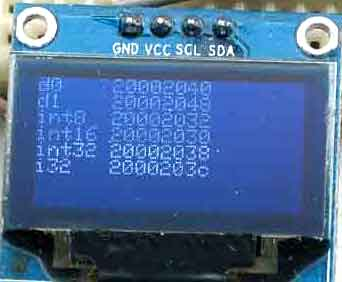

### [OLED display, 128x64 pixels, ssd1306 compatible](https://os.mbed.com/users/bvirk/code/microbitOLED/)

Deals with, in various examples:

- Displaying at OLED display
- Having displaying in 25 led's display as a debugging alternative
- Making code framents to investigate microbit soft- and hardware

#### OLED - class Display

Interface is documentet in files OLED.h and implementation in OLED.cpp

#### 25 led's display - class Display

Types of display

1. a stick
2. numbers in binary on row
    1. binary
    2. binary as part of vertical entity
3. flags

##### 1. A stick

A potentiometer connected between GND og VCC has middle terminal connected to pin P0. In addition to OLED readout, a stick or horisontal, vertical wrapping bargraph is shown.  

    MicroBit uBit;
    ...
    
    uBit.init();

    Display display(uBit.display);
    
    while(true) {
        uint16_t samples =uBit.io.P0.getAnalogValue();
        
        display.setStick(samples/40);
    }
        

##### 2.1 Binary number on each row 

In example_BinaryRows, binary readout is used as an alternatives to watches to signal that threat of execution has past some instruction. A number can be sendt to each row.  

##### 2.1.2 Binary rows as part of entity for the whole display

To understand binay bricks as parts of a together mixed thing, it can be desireable to limit the binary values to dicimal \[0,9] - the display can then, as a whole, show a number in \[0,99999]. The fact that 0 is represented by all led's off, can in some use be unwanted - the leftmost led is not used in readout of a value in \[0,9] and it can be used with other purposes. Struct ledRows used in Display::verClock and Display::verSecClock has a parameter for setting leftmost row - a setting that not excludes overriding that user later.
Two clocks, one with seconds and one without and assert output decimal values grouped.  

##### 3. Flags
The single bits of a 25 bit value is set individualy. Example_flag shows programming  using pointer to functions

#### Code for trying thing out

In main.cpp, int main uses function pointer to make a command pattern - if a device has the program to talk Bluetooth to microbit, it would be possible to chose example from that device. I find it, due to its absence of variable  and intermediate states 'shouting', as appealing as a shells command prompt in flavour of a graphical interface. 

In example_peek.cpp, things a tried to conclude on things hard to find information about. Duckduckgo don't seems to be the same sort of friend in these areas as eg. programming in JAVA. Besides - it is fun to recover c/c++ knowledge

###### size of types

It is in include files - but how much do the really fill - aligned - on stack/heap/global data(ram)/global data(flashed). The primary conclusion is: No need for int8_t, int16_t except:

- bit maipulation
- as class members (isn't testet)
- as global data and on heap (isn't testet)

#### Links

- [lancaster univercity MicroBit docs](https://lancaster-university.github.io/microbit-docs/) 
- [borrowed code  snippets, font and OLED chip programming](https://github.com/Tinkertanker/pxt-oled-ssd1306)  
